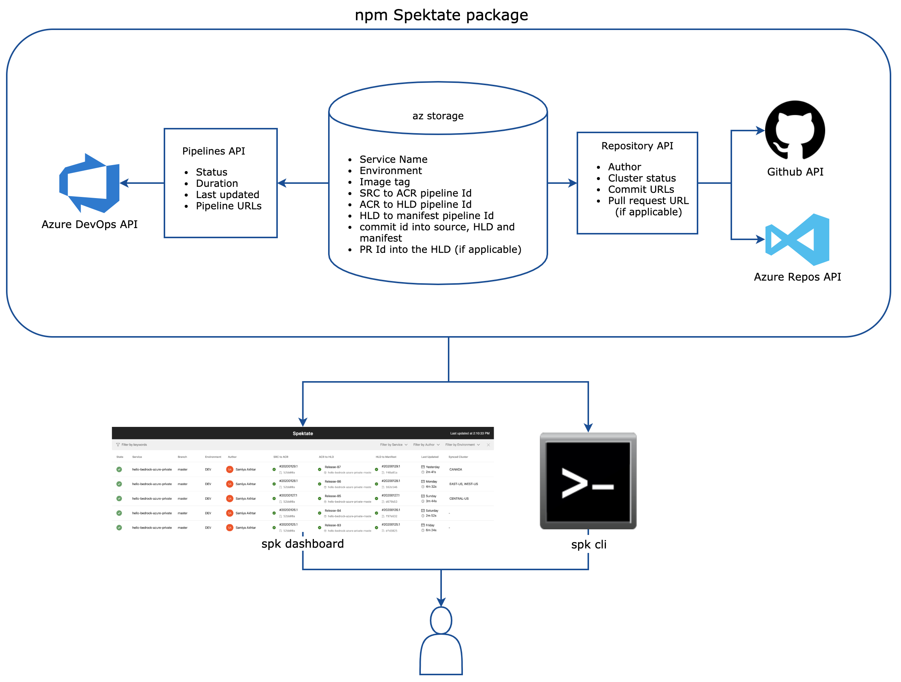
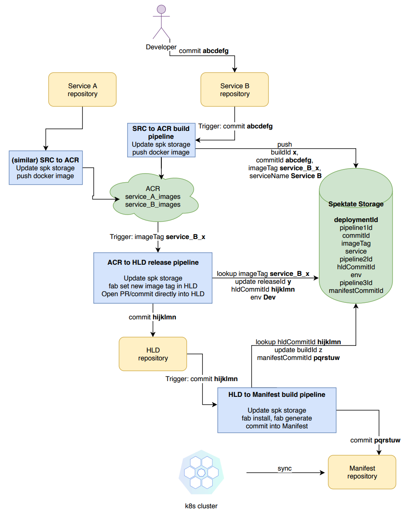

[](https://dev.azure.com/epicstuff/bedrock/_build/latest?definitionId=124&branchName=master)

# Spektate

This is an initiative to visualize [Project Bedrock](https://github.com/microsoft/bedrock). Spektate ties in information from the repositories API, the pipelines API and information stored in an Azure Table to display the dashboard with the following components:



Here's a detailed diagram describing the Spektate workflow. Each pipeline is responsible for sending a unique set of data to the storage, which is used to connect all the pieces together:



Currently, Spektate consists of a command line interface and a simple dashboard prototype. The instructions to use both are below.

Note: Spektate dashboard will delete deployments when their corresponding builds/releases have expired in Azure DevOps.

## Onboard a Bedrock project to use Spektate

Follow the steps in this [guide](https://github.com/CatalystCode/spk/blob/master/docs/service-introspection-onboarding.md) to onboard a project to use Spektate.

## Dashboard prototype

1. Clone this repository, and run `yarn`.
2. Add the following env variables to your shell:

   ```bash
   export REACT_APP_STORAGE_ACCESS_KEY=
   export REACT_APP_STORAGE_TABLE_NAME=
   export REACT_APP_STORAGE_PARTITION_KEY=
   export REACT_APP_STORAGE_ACCOUNT_NAME=
   export REACT_APP_PIPELINE_PROJECT=
   export REACT_APP_PIPELINE_ORG=
   export REACT_APP_PIPELINE_ACCESS_TOKEN=
   export REACT_APP_MANIFEST=
   export REACT_APP_MANIFEST_ACCESS_TOKEN=
   export REACT_APP_SOURCE_REPO_ACCESS_TOKEN=
   ```

   - `REACT_APP_STORAGE_ACCESS_KEY`: Access key for the storage account
   - `REACT_APP_STORAGE_TABLE_NAME`: Table name for the storage account
   - `REACT_APP_STORAGE_PARTITION_KEY`: Partition key for your configuration, you may want to use project name or some identifier that helps separate unrelated configurations for the purpose of introspection.
   - `REACT_APP_STORAGE_ACCOUNT_NAME`: Storage account name
   - `REACT_APP_PIPELINE_PROJECT`: Project name for the pipelines in Azure DevOps
   - `REACT_APP_PIPELINE_ORG`: Org name for the pipelines in Azure DevOps
   - `REACT_APP_PIPELINE_ACCESS_TOKEN`: Access token for pipelines in Azure DevOps
   - `REACT_APP_MANIFEST`: Manifest repository name
   - `REACT_APP_MANIFEST_ACCESS_TOKEN`: Access token for the manifest repository
   - `REACT_APP_SOURCE_REPO_ACCESS_TOKEN`: Access token for the source repository
   - **Note**: If you're using GitHub, add `REACT_APP_GITHUB_MANIFEST_USERNAME`: Account name under which the manifest repository resides.

3. Then run `yarn start` to view the dashboard for the hello world deployment screen.

## Command Line Interface

To use the CLI for Spektate, head over to https://github.com/catalystcode/spk.

# Contributing

This project welcomes contributions and suggestions. Most contributions require you to agree to a
Contributor License Agreement (CLA) declaring that you have the right to, and actually do, grant us
the rights to use your contribution. For details, visit https://cla.opensource.microsoft.com.

When you submit a pull request, a CLA bot will automatically determine whether you need to provide
a CLA and decorate the PR appropriately (e.g., status check, comment). Simply follow the instructions
provided by the bot. You will only need to do this once across all repos using our CLA.

This project has adopted the [Microsoft Open Source Code of Conduct](https://opensource.microsoft.com/codeofconduct/).
For more information see the [Code of Conduct FAQ](https://opensource.microsoft.com/codeofconduct/faq/) or
contact [opencode@microsoft.com](mailto:opencode@microsoft.com) with any additional questions or comments.
