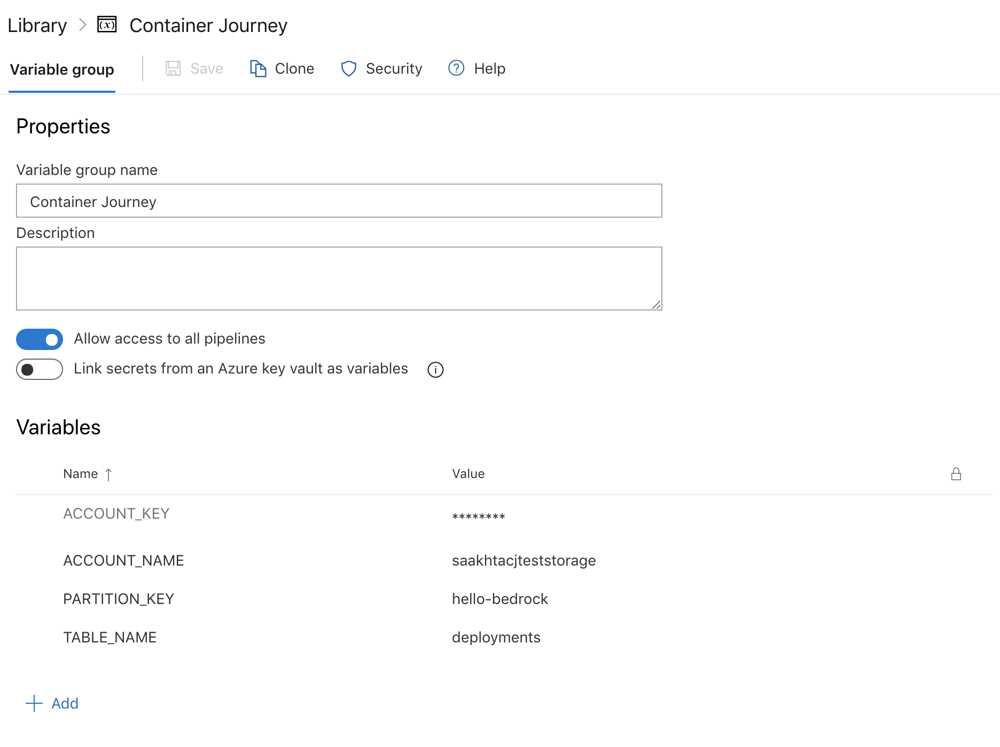

[](https://dev.azure.com/epicstuff/bedrock/_build/latest?definitionId=124&branchName=master)

# Spektate

This is an initiative to visualize [Project Bedrock](https://github.com/microsoft/bedrock). Here's a high level diagram describing the Spektate workflow:


Currently, Spektate consists of a command line interface and a simple dashboard prototype. The instructions to use both are below. 

##  Onboard a Bedrock project to use Spektate

If you have already followed the steps [here](https://github.com/microsoft/bedrock/tree/master/gitops) to setup the pipelines for a GitOps workflow in Bedrock, you may add a task to each of your pipelines to send data to the Spektate storage. 

**Pre-Requisite**: Create an azure storage table account whose access keys you will need to use in subsequent steps.

1. Create a variable group with the following variables, which will be used by the tasks in each of the pipelines to access the storage. 
    - `ACCOUNT_KEY`: Set this to the access key for your storage account
    - `ACCOUNT_NAME`: Set this to the name of your storage account
    - `PARTITION_KEY`: This field can be anything you'd like to recognize your source repository in the storage by, for eg. in this example, we're using the name of the source repository `hello-bedrock`
    - `TABLE_NAME`: Set this to the name of the table in your storage account that you prefer to use

    

    Make sure that you update the pipelines in the following steps to include this variable group, such as below: 
    ```yaml
    variables:
    - group: <your-variable-group-name>
    ```
2. To your CI pipeline that runs from the source repository to build the docker image, copy and paste the following task which will update the database for every build that runs from the source repository to show up in Spektate.

    ```yaml
    - bash: |
        git clone https://github.com/microsoft/spektate.git
        cd spektate/pipeline-scripts

        sudo /usr/bin/easy_install virtualenv
        pip install virtualenv 
        pip install --upgrade pip
        python -m virtualenv venv
        source venv/bin/activate
        python -m pip install --upgrade pip
        pip install -r requirements.txt

        tag_name="$(PARTITION_KEY)-$(Build.SourceBranchName)-$(Build.BuildId)"
        commitId=$(Build.SourceVersion)
        commitId=$(echo "${commitId:0:7}")
        service=$(Build.Repository.Name)
        service=${service##*/}
        echo "python update_pipeline.py $(ACCOUNT_NAME) $(ACCOUNT_KEY) $(TABLE_NAME) $(PARTITION_KEY) p1 $(Build.BuildId) imageTag $tag_name commitId $commitId service $service"
        python update_pipeline.py $(ACCOUNT_NAME) $(ACCOUNT_KEY) $(TABLE_NAME) $(PARTITION_KEY) p1 $(Build.BuildId) imageTag $tag_name commitId $commitId service $service
      displayName: Update source pipeline details in Spektate db
    ```

**Note**: The earlier in the pipeline you add this task, the earlier it will send data to Spektate. Adding it before the crucial steps is recommended since it will capture details about failures if the next steps fail.

3. To your CD release pipeline (ACR to HLD), add the following lines of code to the end of your release task: 

    ```yaml
    latest_commit=$(git rev-parse --short HEAD)

    cd ../spektate/pipeline-scripts

    sudo /usr/bin/easy_install virtualenv
    pip install virtualenv 
    pip install --upgrade pip
    python -m virtualenv venv
    source venv/bin/activate
    python -m pip install --upgrade pip
    pip install -r requirements.txt

    echo "python update_pipeline.py $(ACCOUNT_NAME) $(ACCOUNT_KEY) $(TABLE_NAME) $(PARTITION_KEY) imageTag $(Build.BuildId) p2 $(Release.ReleaseId) hldCommitId $latest_commit env $(Release.EnvironmentName)"
    python update_pipeline.py $(ACCOUNT_NAME) $(ACCOUNT_KEY) $(TABLE_NAME) $(PARTITION_KEY) imageTag $(Build.BuildId) p2 $(Release.ReleaseId) hldCommitId $latest_commit env $(Release.EnvironmentName)
    ```

4. To the HLD to manifest pipeline, we will need to add two tasks, one that updates the storage with the pipeline Id and another with an update for the commit Id that was made into the manifest repo. The reason these two are currently separate steps is to track more information about failures (if they were to happen). For the first step, before the fabrikate steps, add the step below:

    ```yaml
    - bash: |
        git clone https://github.com/microsoft/spektate.git
        cd spektate/pipeline-scripts

        sudo /usr/bin/easy_install virtualenv
        pip install virtualenv 
        pip install --upgrade pip
        python -m virtualenv venv
        source venv/bin/activate
        python -m pip install --upgrade pip
        pip install -r requirements.txt

        commitId=$(Build.SourceVersion)
        commitId=$(echo "${commitId:0:7}")
        echo "python update_pipeline.py $(ACCOUNT_NAME) $(ACCOUNT_KEY) $(TABLE_NAME) $(PARTITION_KEY) hldCommitId $commitId p3 $(Build.BuildId)"
        python update_pipeline.py $(ACCOUNT_NAME) $(ACCOUNT_KEY) $(TABLE_NAME) $(PARTITION_KEY) hldCommitId $commitId p3 $(Build.BuildId)
      displayName: Update manifest pipeline details in CJ db
    ```

    For the step to update manifest commit Id:
    ```yaml
    - script: |
        cd "$HOME"
        cd hello-bedrock-manifest
        latest_commit=$(git rev-parse --short HEAD)
        cd ../spektate/pipeline-scripts
        source venv/bin/activate
        echo "python update_pipeline.py $(ACCOUNT_NAME) $(ACCOUNT_KEY) $(TABLE_NAME) $(PARTITION_KEY) p3 $(Build.BuildId) manifestCommitId $latest_commit"
        python update_pipeline.py $(ACCOUNT_NAME) $(ACCOUNT_KEY) $(TABLE_NAME) $(PARTITION_KEY) p3 $(Build.BuildId) manifestCommitId $latest_commit
      displayName: Update commit id in database
      ```

5. Kick off a full deployment from the source to docker pipeline, and you should see some entries coming into the database for each subsequent deployment after the tasks have been added! 

## Dashboard prototype

1. Clone this repository, and run `npm install`. 
2. Make sure the file located in `src/config.ts` is updated with the config values. 
3. Then run `npm start` to view the dashboard for the hello world deployment screen.

## Command Line Interface

To use the CLI for Spektate:
1. Go to Releases in this repository and download the CLI for your platform.
2. Make it an executable, for eg. `chmod +x cli-macos`
3. Run `init` command to initialize the CLI with configuration for your application. Note that you will only need to run this once on your machine to initialize the CLI. 
    ```bash
    ./cli-macos init --azure-org <azure_organization> --azure-project <azure_project> --docker-pipeline-id <docker_to_HLD_pipeline_ID> --manifest <manifest_repo_name> --github-manifest-username <github_manifest_repo_username_if_using_github> --hld-pipeline-id <hld_to_manifest_pipeline_ID> --src-pipeline-id <src_to_docker_pipeline_ID> --storage-account-key <storage_account_key> --storage-account-name <storage_account_name> --storage-partition-key <storage_account_partition_key> --storage-table-name <storage_table_name>
    ```
4. You may now use the CLI to get information about deployments! (Assuming that you've followed steps above to onboard pipelines to Spektate)

### CLI usage examples

- To query deployments based on
    - image tag: `./cli-macos deployments --image-tag hello-bedrock-master-5439`
    - environment: `./cli-macos deployments --env Staging`
    - commit id in source repository: `./cli-macos deployments --commit-id e3d6504`
    - build id in source pipeline: `./cli-macos deployments --build-id 5439`
    - a combination of any of the above, for eg. `./cli-macos deployments --build-id 5439 --image-tag hello-bedrock-master-5439`
- To query author for a deployment based on
    - commit Id in source repository: `./cli-macos author --commit-id e3d6504`
    - build Id in source pipeline: `./cli-macos author --build-id 5272`
- To query logs URL for a build or release based on
    - build Id: `./cli-macos logs --build-id 5265`
    - release Id: `./cli-macos logs --release-id 102` 
- To query cluster sync status of the Kubernetes cluster, just run `./cli-macos cluster-sync` which would return the commit Id in source repository of the commit which is synced on the cluster.

# Contributing

This project welcomes contributions and suggestions.  Most contributions require you to agree to a
Contributor License Agreement (CLA) declaring that you have the right to, and actually do, grant us
the rights to use your contribution. For details, visit https://cla.opensource.microsoft.com.

When you submit a pull request, a CLA bot will automatically determine whether you need to provide
a CLA and decorate the PR appropriately (e.g., status check, comment). Simply follow the instructions
provided by the bot. You will only need to do this once across all repos using our CLA.

This project has adopted the [Microsoft Open Source Code of Conduct](https://opensource.microsoft.com/codeofconduct/).
For more information see the [Code of Conduct FAQ](https://opensource.microsoft.com/codeofconduct/faq/) or
contact [opencode@microsoft.com](mailto:opencode@microsoft.com) with any additional questions or comments.
