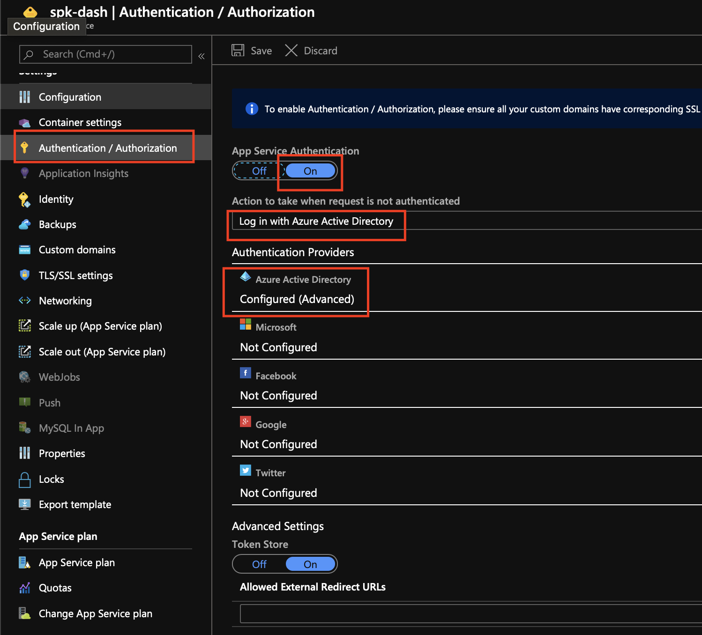
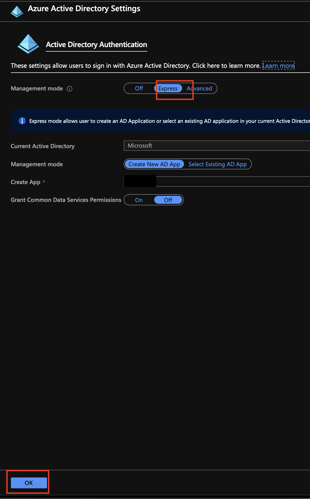
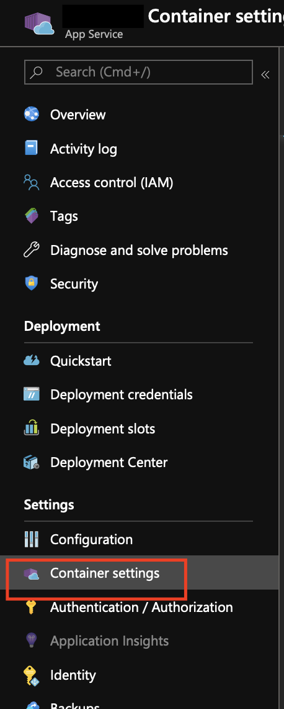

# Hosting Spektate Dashboard with AAD via Azure WebApp for Containers

## Identify App Service Plan

An app service plan needed to defines a set of compute resources for a web app to run.

Create a new app service plan

```bash
az appservice plan create -n $APP_SERVICE_PLAN_NAME -g $RESOURCE_GROUP --is-linux
```

_Alternatively_, you want to re-use an existing app service plan. Use Install `jq` and see what existing app service plans you may already have:

```bash
az appservice plan list | jq '.[].id'
```

## Create an Azure WebApp For Containers with Spektate

Create an Azure WebApp and specify Spektate docker image

```bash
az webapp create -g $RESOURCE_GROUP -p $PLAN_NAME -n $WEB_APP_NAME -i mcr.microsoft.com/k8s/bedrock/spektate
```

**Note**: \$PLAN_NAME should be in the form of `/subscriptions/xxxxxxxx-xxxx-xxxx-xxxx-xxxxxxxxxxxx/resourceGroups/<My Resource Group>/providers/Microsoft.Web/serverfarms/<My Plan Name>`

## Enable AAD Auth for Azure Web App

Navigate to your newly created resource `$WEB_APP_NAME` in the Azure Portal.

1. Click on Authentication/Authorization
2. Click "On" under _App Service Authentication_
3. Choose Login With Azure Active Directory
4. Click Azure Active Directory under _Authentication Providers_



1. Choose Express for _Management Mode_
2. Click Ok at the bottom
3. Make sure to click Save at near the top of the _Authentication / Authorization_ page



## Enable CORS

Allowed the Spektate dashboard to make cross-origin calls

```bash
az webapp cors add -g $RESOURCE_GROUP -n $WEB_APP_NAME --allowed-origins "*"
```

## Set the Environment Variables

Set the environment variables that Spektate needs to run.

```bash
az webapp config appsettings set -g $RESOURCE_GROUP -n $WEB_APP_NAME --settings \
    REACT_APP_MANIFEST=$MANIFEST_REPO_NAME \
    REACT_APP_MANIFEST_ACCESS_TOKEN=$MANIFEST_REPO_PAT \
    REACT_APP_PIPELINE_ACCESS_TOKEN=$AZDO_PIPELINE_PAT \
    REACT_APP_PIPELINE_ORG=$AZDO_ORG_NAME \
    REACT_APP_PIPELINE_PROJECT=$AZDO_PROJECT_NAME \
    REACT_APP_SOURCE_REPO_ACCESS_TOKEN=$MANIFEST_REPO_PAT \
    REACT_APP_STORAGE_ACCESS_KEY=$AZ_STORAGE_KEY \
    REACT_APP_STORAGE_ACCOUNT_NAME=$AZ_STORAGE_NAME \
    REACT_APP_STORAGE_PARTITION_KEY=$PARTITION_KEY_NAME \
    REACT_APP_STORAGE_TABLE_NAME=$AZ_STORAGE_TABLE_NAME
```

## Validate the Docker container is running

Navigate to https://$WEB_APP_NAME.azurewebsites.net. It may take a while for the Docker image to be pulled and loaded.

Visit Container Settings in the left bar menu to read logs about the progress of the Docker image pull and load.


