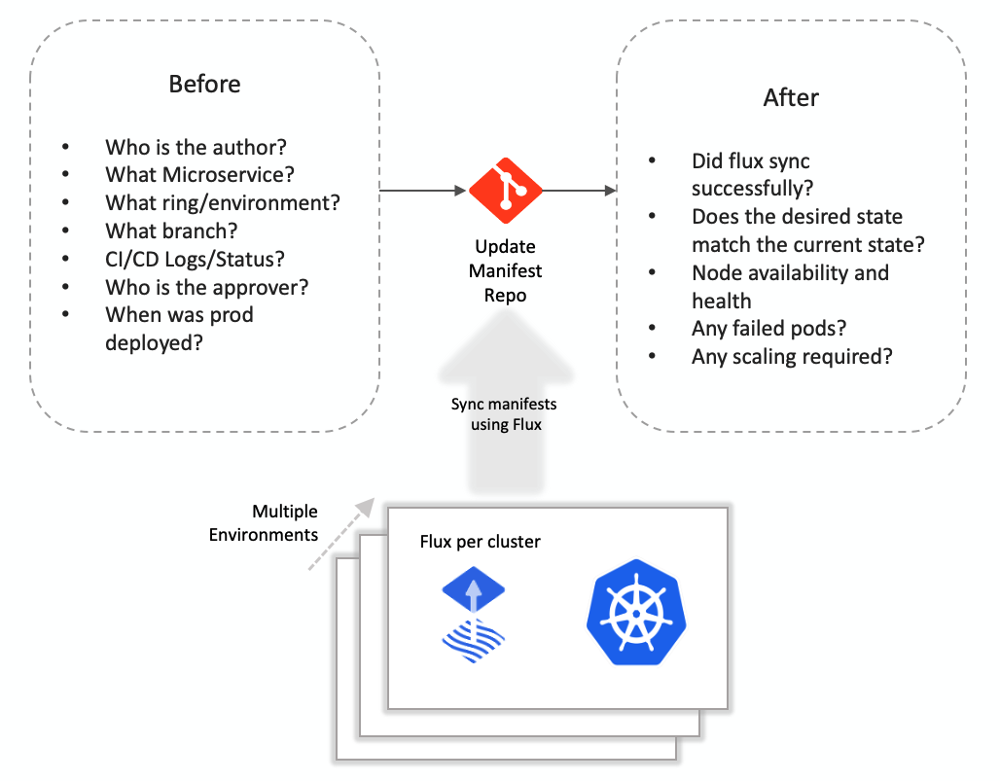
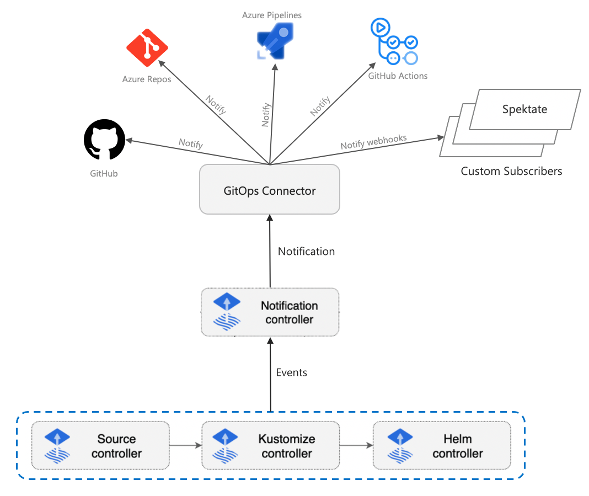
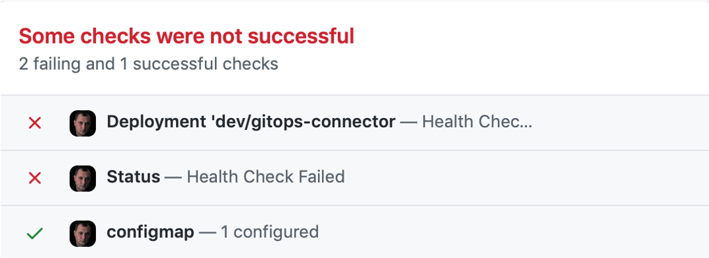
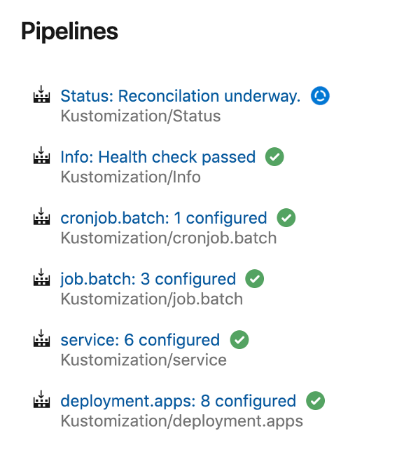
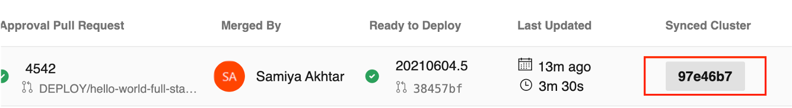
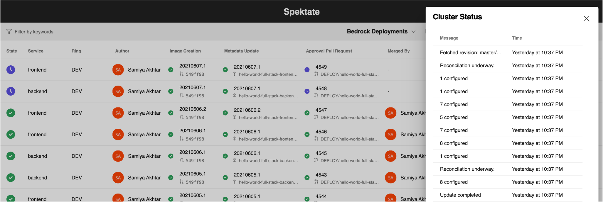

# GitOps Observability with Flux

GitOps empowers developers to describe and observe systems with declarative specifications, by combining Git with Kubernetes’ convergence properties and serving as an operating model for developing and delivering Kubernetes-based infrastructure and applications. GitOps Observability describes the processes involved in taking a built image container from source code to the cluster through the entire GitOps process.

With Spektate, we're observing the "before" up until there is indication from Flux (v1) confirming that the manifest has been applied. In this document, we discuss the options we geet from Flux (v2) in taking this to a step further.



## Flux v2 vs v1

Flux V2 is the next iteration of Flux - it enables the GitOps toolkit and comes with more features. It allows for notifications, syncing from multiple manifest repositories and more customizations with flux. A summary of changes is below:

| Current - Flux v1                                          | Planned - Flux v2                                            |
| ----------------------------------------------------------- | ----------------------------------------------------------- |
| Limited to a single manifest repository         | Can support multiple manifest repositories by creating multiple GitRepository instances                   |
| Manifest repo config has to be set in the flux deployment via either flux cli or helm charts   | `GitRepository` custom resource allows you to setup manifest source that can be reconciled by the `Kustomize` controller       |
| Supports a single manifest repository | Multiple manifest repositories can be added by using multiple `GitRepository` instances |
| Pushes a flux sync tag to the manifest repository to indicate that flux has synced | Has a `NotificationController` dedicated to sending notifications of many kinds, by allowing you to create a custom resource `alert` of many kinds, and even custom webhooks. |
| No separation of concerns and everything is handled by fluxd | Supports client and server side validation by the specialized `KustomizeController`. Note: when no `Kustomization.yaml` file exists, Fluxv2 assumes the entire directory needs to be applied and performs reconciliation in a fashion very similar to fluxv1. This allows us to maintain backwards compatibility with Fluxv1's behavior. |
| Currently in "maintenance mode" | Flux v2 is the direction weave is heavily pushing all flux v1 users to |

## Getting started with flux v2

### Deploy manifest using flux CLI

- Install flux by running `brew install fluxcd/tap/flux` or if you want to download manually, run `curl -s https://toolkit.fluxcd.io/install.sh | sudo bash`
- Then, run `flux install --version=latest` to install all the necessary toolkit components
- Next, we want to run:
  ```
  flux create source git <sourcename> \
  --git-implementation=libgit2 \
  --ssh-key-algorithm=rsa \
  --ssh-rsa-bits=4096 \
  --url=ssh://git@ssh.dev.azure.com/v3/orgname/projectname/manifestrepo \
  --branch=master \
  --interval=30s
  ```

  Make sure that you copy the SSH key it creates and go add it in Settings > SSH Keys in Azure DevOps settings. This will be necessary for flux to create a git source.

- Next, we want to create kustomization, which is the tool used by flux internally to sync the manifest repo with the cluster
  ```
  flux create kustomization gen3 --interval=1m --prune=true --source=<sourcename> --health-check-timeout=30s
  ```

### Deploy using terraform

- Clone [this repository](https://github.com/samiyaakhtar/flux-terraform) and `cd` into it. Create a `terraform.tfvars` file with the following contents:
  ```
  target_path="<path in your manifest where cluster config or manifests reside>"
  url="ssh://git@ssh.dev.azure.com/v3/orgname/projectname/manifestrepo"
  branch_name="<branch name>"
  known_hosts="<cat your known_hosts file by running `cat ~/.ssh/known_hosts | grep azure` and copy the entry for ssh.dev.azure.com (this is needed for create an SSH key successfully)>"
  ```
- Run `terraform init` and `terraform apply`
- There will be an output for an SSH key to create in AzDO settings, which will allow flux to authenticate with AzDO. Make sure to copy this or run `terraform output` to copy and create this key in AzDO settings.


## GitOps Connector

[GitOps connector](https://github.com/microsoft/gitops-connector) is an adapter that "sits between" the CI/CD orchestrators and flux. It receives notifications from the notification controller, processes them into enriched JSON required by the CI/CD tools, and sends POST request with the payload to Github, Azure Repos, or _n_ custom subscribers. This helps close the observability gap between the orchestrators and flux.



Here's an example of how the gitops connector adds observability to Azure DevOps and Github actions:





### Deployment

There's a guide on installing the gitops connector using their helm chart [here](https://github.com/microsoft/gitops-connector#installation).

In order to connect the flux notification controller to the gitops connector, apply the following yaml to the cluster:

```yaml
apiVersion: notification.toolkit.fluxcd.io/v1beta1
kind: Alert
metadata:
  name: gitops-connector
  namespace: <NAMESPACE>
spec:
  eventSeverity: info
  eventSources:
  - kind: GitRepository
    name: <Flux GitRepository to watch>
  - kind: Kustomization
    name: <Flux Kustomization to watch>
  providerRef:
    name: gitops-connector
---
apiVersion: notification.toolkit.fluxcd.io/v1beta1
kind: Provider
metadata:
  name: gitops-connector
  namespace: <NAMESPACE>
spec:
  type: generic
  address: http://gitops-connector:8080/gitopsphase
```

### Spektate with Fluxv2 and GitOps Connector

The enriched notifications from the GitOps Connector greatly improve the observability in Spektate by providing detailed notifications from Flux. With Flux v1, we only receive a tag that determines the commit it's synced to. With Flux v2, we're able to capture a lot more information from the notification controller.






This POC work is currently under the [fluxv2-notifications-poc](https://github.com/microsoft/spektate/tree/fluxv2-notifications-poc) branch.


## Next steps

- Bedrock currently deploys fluxv1 as part of the terraform scripts, it could use a fluxv2 terraform deployment using their [provider](https://github.com/fluxcd/terraform-provider-flux)
- Bedrock could also include the deployment of the GitOps connector to allow notifications in the manfiest repository and potentially Spektate.
- Fabrikate support for Kustomize (partly in this PR: https://github.com/microsoft/fabrikate/pull/311)
- Fabrikate could be modified to spit out manifests in different directories, perhaps by allowing to specify an optional output path name. This would be useful if we want to control the execution order. For eg. we want to create the CRDs before we create the custom resources in K8s, an example of using custom execution order is described in this [example](https://github.com/fluxcd/kustomize-controller#control-the-execution-order)
- Merge the Spektate experience into master and improve the UX.
